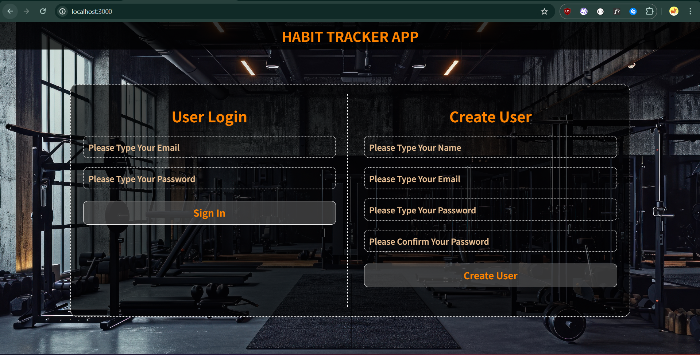
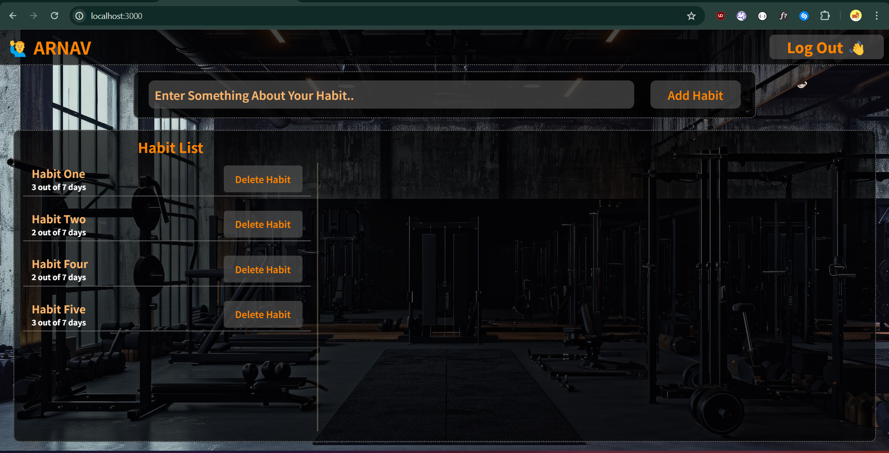
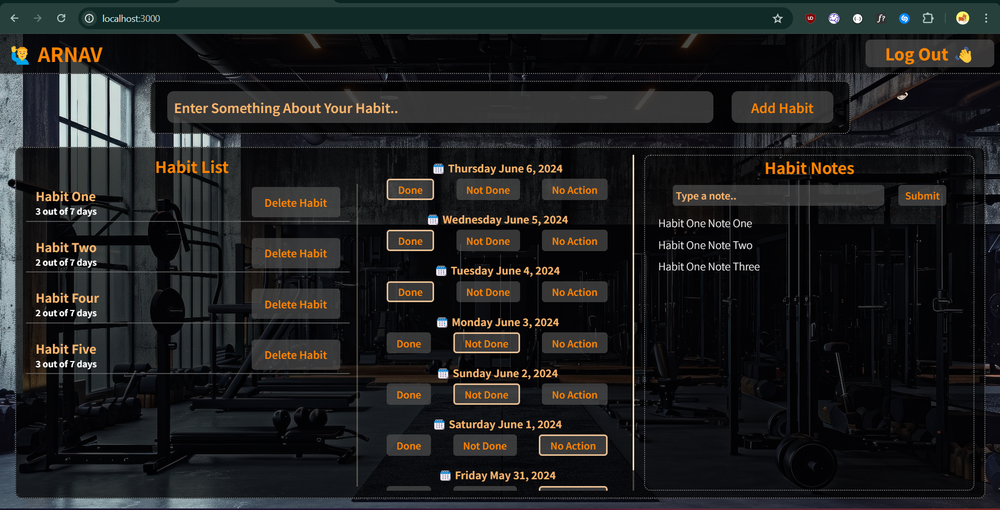

# Basic Habit Tracker App.

This app is my take on the habit tracker app. This is for the solution of coding ninjas skill test (Backend Express).
Lets go over all the screens and functionality of my application.

## Landing Screen.

As you can see, this is tha landing page for my app. Here you can either login as a user if your account exists or you can create a new account and then login. I am using `Passport.js` and `Passport-local.js` for the authentication.

## Homepage Screen.

This is the homepage that appears after you login. As you can see there are a few elements. Now all the elements are according to the logged in user, e.g the Name on top and habit list. Everything will appear according to the logged in user.
Now you can directly type in the input bar to add habit and it would appear in the habit list below immediately.
You can also use the Delete-Habit button to remove the habit form your list.

## Habit-Details.

So when you click on any habit the further elements appear. A section which shows the per date status about the habit (basically date tracking) and a seperate note section (The list will be accoring to individual habit) appears.

Now you can change the status of habit of each day by just cliking on the stauts buttons, (to -- Done, Not Done, No Action). And also add any notes accordingly.

# Thank You.